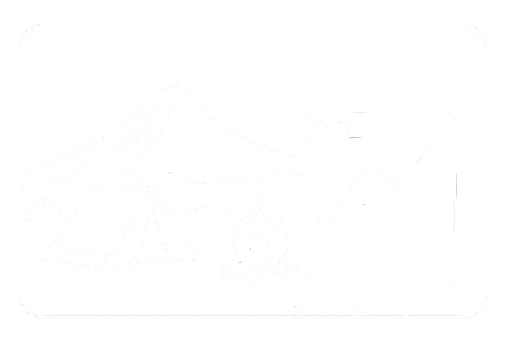
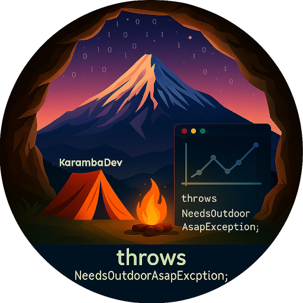

	 
	 
	 

# 👋 Hi, I'm Rafał Stańczuk

**Android Developer | AI Enthusiast | Outdoor Enthusiast**

 
 
 

---

## 📫 Connect With Me

- **LinkedIn**: [in/stanczuk](https://pl.linkedin.com/in/stanczuk)
- **GitHub**: [@rafalstanczuk](https://github.com/rafalstanczuk)
- **Bitbucket**: [karambapl](https://bitbucket.org/karambapl/)
- **Instagram**: [@k4r4m84](https://instagram.com/k4r4m84)

### ☕ Support My Work

If you find my projects helpful or interesting, consider supporting my work:

- [Buy Me a Coffee](https://buymeacoffee.com/k4r4m84)
- [Buy Coffee](https://buycoffee.to/k4r4m84)

---

Hello! I'm a passionate **Android Developer** with over **13 years of professional experience** in the IT industry. My programming journey began in **2000-2001**, and I specialize in building robust, scalable mobile applications with a focus on **clean architecture**, **MVVM**, and **modern Android development practices**.

When I'm not coding, you'll find me exploring caves, running in the mountains, or enjoying outdoor adventures. 🏔️⛰️

---

## 💼 Professional Experience

### 🚀 Current Activities

**Mentoring & Beta Testing**
- Mentoring colleagues in mobile application development
- Google Play app beta testing
- Supporting SaaS and mobile app development

**GpxAnalyzer - Portfolio Project**
- Developing a user-friendly tool for athletes and outdoor enthusiasts
- Features: Strava integration, interactive charts, GPX analysis
- Tech: Java, MVVM, Hilt, Room, RxJava, Jetpack, OAuth2, StravaAPI
- [View Project Details](https://www.linkedin.com/in/stanczuk/details/projects/)

### 🎓 AI Development Certification

**AI_devs Program**
- Advanced AI Agent Development & LLM Integration
- Certificate: [View Credentials](https://credsverse.com/credentials/e67a6661-8d31-48c2-b88f-27690d1c69fc)
- Skills: Python, OpenCV, LLM APIs (OpenAI, Anthropic, Ollama), RAG, Vector Databases, Multimodal AI, AI Agent Architecture

### 💻 Professional Summary

**13+ years of Android Development Experience**

With over a decade of experience in mobile development, I've worked across diverse domains and technologies:

**Domain Expertise:**
- **Healthcare** (~2 years): Led Android development for medical applications, managed cross-platform coordination, mentored teams, and worked with international teams on healthcare solutions
- **Automotive** (~1 year): AOSP development for automotive platforms
- **IoT** (~2 years): Smart Home and Industrial IoT solutions, BLE integration, protocol implementation
- **Telematics** (~1 year): Navigation systems and location-based services
- **MDM** (~1 year): Mobile Device Management solutions
- **eCommerce** (~1 year): Shopping platform development
- **UCC Systems** (~1 year): Unified Collaboration and Communication systems, SDK development
- **Research & Development** (~4 years): Indoor Positioning Systems, A-GPS, algorithm research

**Leadership & Collaboration:**
- Led Android development teams as Main Android Developer
- Managed feature estimation, legacy code maintenance, and cross-platform coordination
- Mentored team members and improved CI/CD processes
- Collaborated with international teams across multiple time zones
- Participated in design and release processes
- Provided technical leadership and code reviews

**Technical Specializations:**
- **Java**: 13+ years of professional experience
- **Kotlin**: 5+ years of production experience
- **C++**: 13+ years (including native development, JNI, NDK)
- **Android SDK**: 13+ years across all Android versions
- **Architecture Patterns**: MVVM, Clean Architecture, MVP (10+ years)
- **Reactive Programming**: RxJava, Coroutines, Flow (8+ years)
- **Dependency Injection**: Dagger, Hilt (7+ years)
- **BLE & IoT**: 4+ years of Bluetooth Low Energy and IoT development
- **Geospatial**: Location services, GPS, mapping (5+ years)
- **Python & AI**: Recent experience in AI agent development and LLM integration

---

## 🛠️ Technical Skills

### Languages

### Android Technologies
- **Architecture**: MVVM, Clean Architecture, MVP
- **Jetpack**: Room, Navigation, LiveData, ViewModel, Data Binding, View Binding
- **Dependency Injection**: Dagger Hilt, Dagger 2
- **Reactive Programming**: RxJava, RxAndroid, Coroutines, Flow
- **Networking**: Retrofit2, OkHttp3, OAuth2
- **Persistence**: Room, Realm, SQLite
- **Testing**: Mockito, JUnit
- **Other**: BLE, NFC, ML Kit, NDK, JNI, OpenGL

### Tools & Platforms

### AI & Machine Learning
- LLM Integration (OpenAI, Anthropic, Ollama)
- RAG (Retrieval-Augmented Generation)
- Vector Databases, Graph Databases
- Multimodal AI (Text, Voice, Image)
- AI Agent Development
- Advanced Prompt Engineering

### Domains
- 🏥 **Healthcare**: Medical applications, health monitoring
- 🚗 **Automotive**: AOSP, Android Automotive
- 🏪 **eCommerce**: Shopping platforms
- 🏠 **IoT**: Smart Home, Industrial IoT
- 📱 **MDM**: Mobile Device Management
- 🗺️ **Telematics**: Navigation systems, location services
- 🎯 **Wellness**: Fitness tracking, activity analysis

---

## 📚 Education

**Master of Computer Science** - Faculty of Mechanical Engineering and Computer Science
- **Specialty**: Applied Computer Science
- **Master Thesis**: "Collision detection of irregular objects in two-dimensional Cartesian space"
- **Technologies**: C++, OpenGL, Linux
- **Research**: Time profiling, swarms of objects, clustering algorithms

**Previous Studies**: Numerical methods (Finite Derivative Methods, Finite Elements Methods)
- C++, STL, OpenGL, OpenMP

---

## 🎯 Featured Projects

### [GpxAnalyzer](https://github.com/rafalstanczuk)
A comprehensive GPX activity analyzer for athletes and outdoor enthusiasts featuring:
- Strava integration with OAuth2
- Interactive charts and visualizations
- Geospatial analysis with OpenStreetMap
- Digital Signal Processing algorithms
- Clean Architecture with MVVM

### [Jurassic](https://github.com/rafalstanczuk/Jurassic)
Geospatial image viewer designed for speleological (caving) exploration activities.

### [Task Manager PHP](https://github.com/rafalstanczuk/taskmanager-php)
Production-ready Task Manager with vanilla PHP 8.2 featuring RESTful API and interactive Gantt chart with drag-and-drop scheduling.

### [ContentObserverService](https://github.com/rafalstanczuk/contentobserverservice)
Educational Android project demonstrating background services, content observers, and data synchronization.

### Early Programming Projects
My programming journey started in **2000-2001**, and these early projects represent my exploration of fundamental programming concepts:
- **PascalPaintRs**: Graphics programming with Borland Pascal - one of my first explorations into graphics programming
- **PascalStatkiRS**: Classic Battleship game in Borland Pascal - demonstrating game programming fundamentals

[View All Projects](https://www.linkedin.com/in/stanczuk/details/projects/)

---

## 🏔️ Additional Activities

**Outdoor Enthusiast**

My passion for outdoor activities often inspires my technical projects, especially those related to geospatial analysis and activity tracking.

---

## 🎓 Certifications & Achievements

- ✅ **AI_devs Program Certificate** - AI Agent Development & LLM Integration

---

*"Code is like humor. When you have to explain it, it's bad." - Cory House*

---

**Note**: This profile showcases my professional journey and passion projects. Feel free to explore my repositories and reach out if you'd like to collaborate or discuss Android development, AI, or outdoor adventures! 🚀

